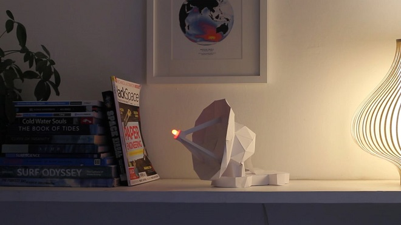
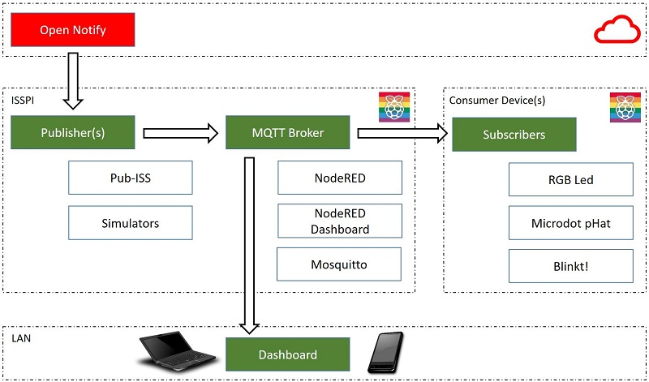

# Arthur Remix

We love the idea and concept of [Project_Arthur](https://apollo50.co.uk/project-arthur/) from [Apollo50](https://apollo50.co.uk). As a team of tinkerers we decided to give it a go and add new features. Enter **Arthur Remix** - a project inspired by the original work and a project which adds features / extra hardware and ideas from our own work. This couldn't have happened without the first inspiration of **Apollo50** and [open-notify](http://open-notify.org).

Originally, we added some RGB lights, then a blinking array of leds etc., until this work emerged. **Arthur Remix** is a remake and extension of the originals, the **Arthur_Project**, with a twist.

> The Arthur project is a great idea by **Apollo50** to build the iconic Arthur satellite dish, which broadcasted transatlantic broadcasts of Neil Armstrong's first walk on the moon on July 20, 1969, to UK. You can construct a 3d paper model created by the apollo50 team, and attach an indicator to track the location of ISS (International Space Station) at a given location. See the original project [here](https://apollo50.co.uk/project-arthur/) or start with our extras below.



*The original Project_Arthur*

We have embraced this great idea, and the [paper 3D model](https://github.com/Apollo50/ISS_Arthur). However we made our own version of the software to meet the [Raspberry Valley makerspace](http://raspberry-valley.azurewebsites.net) needs and to try to extend the concept. While we love [IFTTT](https://ifttt.com) (used in the original), we wanted to use a more direct approach.

Further, we wanted to add other consumers of the information feeds, such as Arduino devices and other gadgets. As we already have a bunch of projects running a Raspberry Pi MQTT server with Node-RED, development soon turned to this direction. As we have a team of people with great ideas (and schools we work with full of children with even greater ideas), we have multiple versions of the original.

## Introduction

There are several versions of software present in our repository, in order to cover several scenarios. Choose one or the other (or all) to setup your ISS station

* stand-alone configurations: classes and scripts for running the project at various configurations. We are using an RGB Led, a LED array ([Blinkt!](http://raspberry-valley.azurewebsites.net/Blinkt/)) or a Digit display ([Micro-dot pHat](https://shop.pimoroni.com/products/microdot-phat)). Choose which you like or which you have
* publishers and subscribers for the MQTT backend we use at our makerspace. To build it or download it, follow our guide here: [IoT Raspberry Pi Device](https://raspberry-valley.azurewebsites.net/IoT-Raspberry-Pi-Device/), or here [IoT Raspberry Pi Device on Docker](https://raspberry-valley.azurewebsites.net/IoT-Raspberry-Pi-Device-on-Docker/). This is a more sophisticated scenario: you run an IoT server with MQTT, allowing you to 'consume once' and display multiple ways on your local network, with different display devices and locations.
* Extensions of the MQTT concepts with Node-RED Dashboard, including maps on Node-RED Dashboard (see the guides in the above section to get it installed fast): A scenario which requires the above MQTT concept, and adds Node-RED display stuff. Simulator, widget, maps etc.

See [Project Arthur on Github](https://github.com/Apollo50/ISS_Arthur) to get the 3D paper models, and if you wish to run the original software (using IFTTT). Or dive into our software and make the model with a different software version, using [open-notify](http://open-notify.org). Or make your own version and share with us, and Apollo50.

## Installation

We will be installing several libraries for different scenarios of use. You can read about the available scenarios in the section **Usage Scenarios**.

* Setup a Raspberry Pi with a recent version of Raspbian. There's plenty of tutorials out there, or you might have an installation running already
* Configure your Python. We are using Python 3 everywhere, so it's a good idea to make it default. Try our tutorial [Set Default Version of Python](https://raspberry-valley.azurewebsites.net/Python-Default-Version/).
* Clone this repository to your home directory
* navigate to the **python-code** directory and run the scenario(s) of choice. Once you are happy with the usage of individual components, update the file **launcher.py**. We will assume you are using the launcher to launch all your components for later steps
* Launch the code

```bash
python launcher.py
```

* Once you are happy with the functionality, set our launcher to autostart. You can find a tutorial on how to do it on our site: [Autorun Python Script](https://raspberry-valley.azurewebsites.net/Autorun-Python-Script/)
* Restart the Pi and check all works as expected

Done!

## ISS Status Code

All usage scenarios use an **ISS Status Code** (blink mode), which indicates the relative position of ISS compared to your location. As we have mostly limited display capabilities, the mode is translated to various led blinking patterns. 

The **ISS Status Code** is respected by all our ISS code and can come with the following codes:

* 0 - no connection available
* 1 - other error (unspecified)
* 2 - far away: the ISS is not coming anytime soon
* 3 - coming soon (in 30 minutes): the ISS will arrive on the horizon within 30 minutes. Time to grab your telescope (and coat) and head out. We do not at this point in time count in daylight status, weather etc.
* 4 - nearly here (1 minute to go): time to focus - within 1 minute, the ISS will be visible!
* 5 - overhead: The ISS is visible on the sky! Don't look at the Leds, look at the real thing!

## Usage Scenarios

Below sections describe various usage scanarios for the ISS Overhead solution. Choose one or the other, or mix them up. They need not be run in a sequence and/or all, instead select the application which fits your hardware or makes the best sense for you.

One thing binds them: the **ISS Status Code**, described above.

### Stand-Alone vs. Pub/Sub

In general, we use our ISS code in 2 ways.

**Stand-Alone Scenarios**:

The simplest scenarios are **Stand-Alone** scenarios. These are cases, where you setup a Pi, clone our software and run one script to indicate when ISS will be overhead. No servers required, no complex setup required.

The stand-alone scenario is a quick test approach. We of course prefer the more complex, but much more feature-rich pub/sub scenario, described below.

**Pub/Sub (Subscriber) Scenarios**:

We also provide 'subscriber' scenarios (pub/sub via MQTT). In this case, we use one of our IoT device setups and separate the capturing of the information via a publisher (the publisher is always the same) and various subscribers for various hardware. 

Below is the general idea of our pub/sub architecture, read more in the [architecture](architecture.md) document.



Again, you can use our code provided in this repo, or spin your own subscribers. In general, there are several topics you can subscribe to (find them in the 'config.py' file), but the key topics are:

* **Countdown**: a topic which publishes number of seconds remaining to ISS being overhead, and
* **Status**: the ISS status described above

To setup one or more of those subscriber scenarios, you need to:

* Configure your Pi as an [IoT Raspberry Pi Device](https://raspberry-valley.azurewebsites.net/IoT-Raspberry-Pi-Device/), or if you like Docker, as an [IoT Raspberry Pi Device on Docker](https://raspberry-valley.azurewebsites.net/IoT-Raspberry-Pi-Device-on-Docker/). You can also download our ready made images instead.
* Run the ISS publisher **pub-iss.py**
* Run the appropriate subscriber - any one of the **sub-iss-xyz.py** files, based on your preference and available hardware. You can also run one IoT server, and multiple subscribers on different hardware, provided they can connect to the server via a network.
* As a bonus, we added some extra scripts in Node-RED. Read more on our [Dashboard](dashboard.md) page. Once you have setup an IoT device, you can also connect to your Node-RED server and control it via a web browser.

Most of the subscriber scenarios require you to run several scripts. For your convenience, we have provided a simple way to run all from one session: locate **launcher.py** and edit it to your liking. Add / remove scripts you need to use for your configuration. To run, simply launch

```bash
python launcher.py
```

## About

Raspberry Valley is a maker community in Karlskrona, Sweden, sponsored by [Dynapac](https://dynapac.com/en). We run makerspaces every week, working with Raspberry Pis, Arduinos and other interesting hardware.

This repository is here to support our community of makers. A lot of our achievements are based and inspired by the community at large. We wish to pay back and share our experiences and lessons learned. Join us!

You can find our pages here: [Raspberry Valley](https://raspberry-valley.azurewebsites.net). You can also join us on [Twitter](https://twitter.com/RaspberryValley) or check [Docker Hub](https://hub.docker.com/r/raspberryvalley/) for images of interest.

## Links

Project Pages:

* [Architecture](architecture.md)
* [Node-RED Dashboard for ISS](dashboard.md)
* [open-notify for Arthur-Remix](opennotify.md)
* [Code Description](codedescription.md)
* [Project Gallery](gallery.md)
* [Setup Raspberry Pi Image](imagesetup.md)
* [Usage Scenarios](usage-scenarios.md)

External Resources:

* [Project Arthur](https://apollo50.co.uk/project-arthur/) - the original by [Apollo50](https://apollo50.co.uk)
* [Project Arthur on Github](https://github.com/Apollo50/ISS_Arthur) - models of cut-outs in PDF
* [open-notify](http://open-notify.org) - the ISS web services (plus extras)
* [RPi.GPIO](https://pypi.org/project/RPi.GPIO/)

Other ISS Links:

* Track ISS [here (eesa)](https://spotthestation.nasa.gov/tracking_map.cfm)
* Track ISS [also here](https://www.n2yo.com/?s=28654)

Raspberry Valley makerspace links

* [Raspberry Valley](https://raspberry-valley.azurewebsites.net) - Other things we make and do
* [Raspberry Valley on Twitter](https://twitter.com/RaspberryValley)
* [Raspberry Valley on Github](https://github.com/raspberryvalley)
* [Raspberry Valley Docker Hub Images](hub.docker.com/r/raspberryvalley/)
