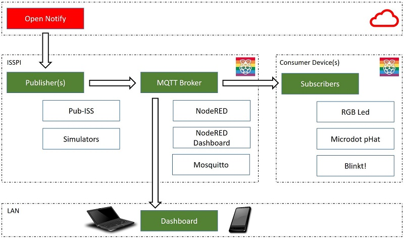

# Architectue

This section describes the overall architecture, which is built around pub/sub.

## General Idea

The general idea of our layout is to utilize an MQTT broker somewhere on your local network, and use it to capture and distribute ISS events to multiple listeners. So regardless if you use one device or many, the ISS information is captured from the internet once, then used several times.

Here is a general layout of Arthur-Remix

There are 3 parts to the layout:

* the **open-notify** service, which provides all ISS data. Read more in the section [open-notify for Arthur-Remix](opennotify.md)
* One or more Raspberry Pi boards. You need at least one to act as the MQTT server on your network, then run clients on the same boards and / or other machines. Those are not necessarily Raspberry Pi boards, in fact we also use Arduinos and standard PCs (Windows, Linux)
    * Here, the server is called **ISSPI**, the clients are **Consumer Devices**. Nothing stops you from wiring it up on one board if you want
* Dashboard clients on the LAN: apart from wiring up 'things' to react to the ISS position, we can also utilize the Node-RED dashboard, which is serving interesting data, plus our simulators. Read more here: [Node-RED Dashboard for ISS](dashboard.md).