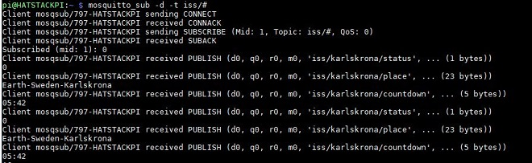

# Code Description

This page describes how individual components work in slightly more detail. We have tried to document the code in detail already in the source files; this page is intended to provide some more context.

## Code Elements

Our software uses Python 3. Our examples assume you have made the Python 3 release default. To do so, you can follow our guide [Set Python 3 as default](https://raspberry-valley.azurewebsites.net/Python-Default-Version/).

To setup your system, you also need [RPi.GPIO](https://pypi.org/project/RPi.GPIO/) installed. In a nutshell, you can install the library (both for Python 2 and 3) as follows (notice we also install python-dev as a pre-requisite):

```bash
sudo apt-get install python-dev
sudo apt-get install python-rpi.gpio python3-rpi.gpio
```

### config

The idea of **config.py** is to have one configuration file for all flavors of the ISS indicators code and to allow easy configuration of all solutions from one place. Depending on scenario, some settings are used, some not.

Generally, you can configure settings for the following areas:

* **Broker Settings**: The broker section allows you to configure everything about your MQTT server. Location on the network, Port, credentials
* **Pub/Sub Topics**: This section extends MQTT Broker settings by providing topics used across the ISS solution
* **Location Settings**: In this section, you provide the longitude/latitude of the place where you are watching the ISS. You also provide a friendly name of your location
* **RGB Led Section**: You define the pins used for your RGB Led

### netutil

We have thrown in a module for basic network utilities. In this code, we only need to validate the availability of an internet connection.

Example usage:

```python
import netutil
...

def have_connection()
    test_connection = check_internet()
    return test_connection
...

if (have_connection()):
    # do something
```

The utility uses Google by default. You might want to check against some other server (maybe the availability of your own service). Then just use the optional parameter, as shown in the snippet below:

```python
...
    test_connection = check_internet(url='http://www.myserverurl.com')
...
```

### timetoISS

TODO

To debug the class, or new features, you can launch the script directly. You can set a logging level if you wish (or run without the parameter for defaults)

```bash
python timetoISS.py -ll INFO
```

or

```bash
python timetoISS.py --loglevel INFO
```

The available logging parameters are:

* DEBUG
* INFO
* WARNING
* ERROR
* CRITICAL

### pub-ISS

The **pub-ISS.py** file contains an MQTT sender, which sends countdown information for ISS (international space station) until it is overhead. Specifically, we send the countdown string, place where countdown is applicable and countdown status. This approach ensures we have completely decoupled the logic of retrieving the data from the logic of displaying the data. Comes in very handy with multiple locations, more machines in your IoT network etc. And is elegant!

This code uses the **iss_overhead** class to forecast, when ISS is overhead, by providing coordinates for a given location. See the **iss_overhead** documentation for more details.

Configuration of **pub-ISS.py** is handled in the **config.py** configuration file. Specifically, we recover MQTT connection details, topic names for all 3 topics and location information for configuring **iss_overhead**.

Once the script is connected to an MQTT broker, it starts sending the data at a pre-configured interval. The easiest way to visualize it is to use our Node-RED nodes, but of course you can simply subscribe to the Mosquitto broker. You might see something similar to the picture below:



If you wish to avoid the hassle of setting up your broker, just use our [IoT Raspberry Pi Device](https://raspberry-valley.azurewebsites.net/IoT-Raspberry-Pi-Device/) - you'll get an out of the box environment for handling your MQTT flows. If you're more inclined to use Docker images, we have you covered as well. Just use the [IoT Raspberry Pi Device on Docker](https://raspberry-valley.azurewebsites.net/IoT-Raspberry-Pi-Device-on-Docker/) instead.

### sub-ISS-blinkt

This script is an MQTT listener, which reacts to the ISS (international space station) countdown status.

This Python 3 code is one in a series of MQTT listeners, reacting to the ISS countdown components, implemented on different hardware (but using the same principle).

In this code, we use the Pimoroni Blinkt! (https://shop.pimoroni.com/products/blinkt) device to indicate the proximity of ISS by subscribing to the status feed (see 'iss_overhead' documentation).

We react to one of the statuses described in the overview section (2-far away, 3-coming soon ...)

The indicator itself is a modification of the pulse.py example, with a different context. Make your own, and share with us using this template!

### sub-ISS-microdot

This script is an MQTT listener, which reacts to the ISS (international space station) countdown status.

This Python 3 code is one in a series of MQTT listeners, reacting to the ISS countdown components, implemented on different hardware (but using the same principle).

In this code, we use the [Pimoroni Micro dot pHat](https://shop.pimoroni.com/products/microdot-phat) device to indicate the proximity of ISS by subscribing to the timeout value (see 'iss_overhead' documentation).

Learn more about using the Micro dot pHat by visiting the [Micro dot pHat tutorial](https://learn.pimoroni.com/tutorial/sandyj/getting-started-with-micro-dot-phat)

### iss_rgb_led

**iss_rgb_led** is a class which connects any RGB diode and reacts to the ISS blink statuses described above.

To use, do something like this:

```python
import iss_rgb_led
...
# initiate the **iss_rgb_led** class 
blinker = iss_rgb_led.iss_rgb_led(config.rgbled_red, config.rgbled_green, config.rgbled_blue) 
while True:
  status = <retrieve status here>
  blinker.set_ISS_code(status)
```

The routine takes care of the rest. As always, you can configure the settings in **config.py**.

You can see a full usage example in **iss-rgb.py**

To debug the class, or new features, you can launch the script directly. You can set a logging level if you wish (or run without the parameter for defaults)

```bash
python iss_rgb_led.py -ll INFO
```

or

```bash
python iss_rgb_led.py --loglevel INFO
```

The available logging parameters are:

* DEBUG
* INFO
* WARNING
* ERROR
* CRITICAL

### sub-ISS-rgb-led

This script is an MQTT listener, which reacts to the ISS (international space station) countdown status.

This Python 3 code is one in a series of MQTT listeners, reacting to the ISS countdown components, implemented on different hardware (but using the same principle).

In this code, we use an RGB Led (common anode) to indicate the proximity of ISS by subscribing to the status value (see 'iss_overhead' documentation).
