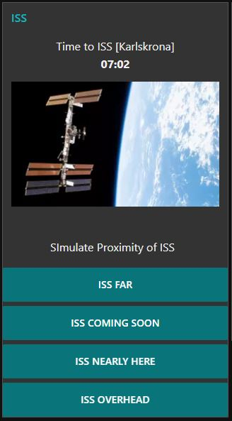

# Node-RED Dashboard Setup

Apart from our Python and Arduino code blinking various leds, we have also created a few widgets for your Node-RED setup. If your Pi is running Node-RED together with the Node-RED Dashboard and is listening to a Mosquitto server somewhere on your network, you can also follow the status of the ISS via a browser. Plus follow the ISS station on a world map.

These features are a nice complement to the basic code provided.

## Installation

Installation of Node-RED and Node-RED Dashboard is covered elsewhere. However you can download our pre-made image for Raspberry Pi if you don't wish to setup the environment yourself.

**Pre-Requisites**:

* MQTT Server (Mosquitto), Node-RED, Node-RED Dashboard. Check our images and guides here: [IoT Raspberry Pi Device](https://raspberry-valley.azurewebsites.net/IoT-Raspberry-Pi-Device/), or here: [IoT Raspberry Pi Device on Docker](https://raspberry-valley.azurewebsites.net/IoT-Raspberry-Pi-Device-on-Docker/). Choose one or the other according to your preferences
    * To learn more about Node-RED and Node-RED Dashboard, visit our detailed guides on using them with a Raspberry Pi found [here](https://raspberry-valley.azurewebsites.net/Node-RED/) and [here](https://raspberry-valley.azurewebsites.net/Node-RED-Dashboard/)
* You are running our publisher - **pub-iss.py** somewhere on your network

**Installation**:

* Setup your Node-RED environment (see section 'pre-requisites')
    * Setup [node-red-contrib-web-worldmap](https://flows.nodered.org/node/node-red-contrib-web-worldmap) if you wish to use the mapping feature
* Configure **config.py** with your topic names (we assume further down you are using the defaults)
* Copy the Node-RED features from below sections (you can choose all or several) and import the nodes into Node-RED
    * modify topic paths if you have changed default topics to your own
* Launch the **pub-iss.py** script to start publishing proximity codes and time-outs
* Once you are happy with the functionality, you can autorun the Python code used. Check out our guide [Autorun Python Script](https://raspberry-valley.azurewebsites.net/Autorun-Python-Script/), if you don't know how to

## Node-RED Dashboard ISS Features

Below are our code snippets for Node-RED Dashboard. Choose and install the ones you like

### Node-RED WorldMap

If you wish top track the ISS on a world map, you might want to use the Node-RED node [node-red-contrib-web-worldmap](https://flows.nodered.org/node/node-red-contrib-web-worldmap) - A Node-RED node to provide a web page of a world map for plotting things on. Please check the documentation on the home page.

The layout is up to you, but you might want to start from our Node-RED code below:

```json
[{"id":"bd80cf80.0cfb8","type":"worldmap","z":"130ddc72.ae2774","name":"ISS-Map","lat":"","lon":"","zoom":"","layer":"Esri Terrain","cluster":"","maxage":"","usermenu":"show","layers":"show","panit":"true","path":"","x":860,"y":1260,"wires":[]},{"id":"95009e8d.d5c14","type":"change","z":"130ddc72.ae2774","name":"Convert location","rules":[{"t":"set","p":"payload.name","pt":"msg","to":"ISS","tot":"str"},{"t":"set","p":"payload.lat","pt":"msg","to":"payload.iss_position.latitude","tot":"msg"},{"t":"set","p":"payload.lon","pt":"msg","to":"payload.iss_position.longitude","tot":"msg"},{"t":"set","p":"payload.icon","pt":"msg","to":"satellite","tot":"str"}],"action":"","property":"","from":"","to":"","reg":false,"x":680,"y":1260,"wires":[["bd80cf80.0cfb8"]]},{"id":"1e7f7e67.8fb522","type":"json","z":"130ddc72.ae2774","name":"","property":"payload","action":"","pretty":false,"x":510,"y":1260,"wires":[["95009e8d.d5c14"]]},{"id":"93a71989.e80258","type":"http request","z":"130ddc72.ae2774","name":"OpenNotify Current","method":"GET","ret":"txt","url":"http://api.open-notify.org/iss-now.json","tls":"","x":330,"y":1260,"wires":[["1e7f7e67.8fb522"]]},{"id":"497dd40.47bb12c","type":"inject","z":"130ddc72.ae2774","name":"","topic":"","payload":"","payloadType":"date","repeat":"60","crontab":"","once":false,"onceDelay":0.1,"x":130,"y":1260,"wires":[["93a71989.e80258"]]},{"id":"ea9c0785.8a7138","type":"comment","z":"130ddc72.ae2774","name":"Open-Notify Current ISS Location","info":"","x":150,"y":1200,"wires":[]}]
```

You will get a display similar to this (navigate to your Pi using this URL: ```http://yourPIaddress:1880/worldmap/```):


Please note that for any webpage you have, you can use the leaflet and jQuery, as described on the [open-notify API Documentation](http://open-notify.org/Open-Notify-API/).

To learn more about Node-RED and Node-RED Dashboard, visit our guide on using them with a Raspberry Pi found [here](https://raspberry-valley.azurewebsites.net/Node-RED/) and [here](https://raspberry-valley.azurewebsites.net/Node-RED-Dashboard/)

### Countdown Timer

One of the applications of **pub-ISS** is to capture the feed directly in a Node-RED dashboard. You can roll your own Dashboard, or simply use our guides and/or images. Deploy the widget below (copy, then import in Node-RED) for a quick start, then hack away to improve it ...

The code below gives you a rendering of the ISS countdown, as shown below.


```json
[{"id":"cc450730.727228","type":"comment","z":"130ddc72.ae2774","name":"ISS","info":"The ISS countdown widget, using Node-RED and the Raspberry Valley application.\n\nWe are extending Project Arthur with extra features.","x":90,"y":720,"wires":[]},{"id":"9582ed15.43799","type":"mqtt in","z":"130ddc72.ae2774","name":"ISS-countdown","topic":"iss/karlskrona/countdown","qos":"2","broker":"889cb996.0325c8","x":120,"y":780,"wires":[["1ff6ab2a.95df25"]]},{"id":"1ff6ab2a.95df25","type":"ui_template","z":"130ddc72.ae2774","group":"8c22c5ab.903f68","name":"iss-template","order":0,"width":0,"height":0,"format":"","storeOutMessages":true,"fwdInMessages":true,"templateScope":"local","x":310,"y":780,"wires":[["2291043a.8b850c"]]},{"id":"2291043a.8b850c","type":"ui_text","z":"130ddc72.ae2774","group":"8c22c5ab.903f68","order":0,"width":0,"height":0,"name":"ISS-KK","label":"Time to ISS [Karlskrona]","format":"{{msg.payload}}","layout":"col-center","x":480,"y":780,"wires":[]},{"id":"889cb996.0325c8","type":"mqtt-broker","z":"","name":"local","broker":"localhost","port":"1883","clientid":"","usetls":false,"compatmode":true,"keepalive":"60","cleansession":true,"birthTopic":"","birthQos":"0","birthPayload":"","closeTopic":"","closeQos":"0","closePayload":"","willTopic":"","willQos":"0","willPayload":""},{"id":"8c22c5ab.903f68","type":"ui_group","z":"","name":"ISS","tab":"e47055ae.c444f8","disp":true,"width":"6","collapse":false},{"id":"e47055ae.c444f8","type":"ui_tab","z":"","name":"tabenv","icon":"dashboard"}]
```

### ISS Simulator

For your convenience, we have also made a 'simulator' of statuses, to debug your own software and components. You can import the following script into Node-RED to simulate out of the box!

```json
[{"id":"e349080.8b702f8","type":"mqtt out","z":"130ddc72.ae2774","name":"send ISS code","topic":"iss/karlskrona/status","qos":"","retain":"","broker":"889cb996.0325c8","x":580,"y":980,"wires":[]},{"id":"8f960d62.730f9","type":"comment","z":"130ddc72.ae2774","name":"SImulate ISS proximity","info":"","x":160,"y":920,"wires":[]},{"id":"ece6174d.9b7c88","type":"ui_button","z":"130ddc72.ae2774","name":"SIM ISS Coming Soon","group":"8c22c5ab.903f68","order":5,"width":0,"height":0,"passthru":false,"label":"ISS Coming Soon","color":"","bgcolor":"","icon":"","payload":"3","payloadType":"str","topic":"","x":160,"y":1020,"wires":[["e349080.8b702f8"]]},{"id":"b6390e17.d3068","type":"ui_button","z":"130ddc72.ae2774","name":"SIM ISS Far","group":"8c22c5ab.903f68","order":4,"width":0,"height":0,"passthru":false,"label":"ISS Far","color":"","bgcolor":"","icon":"","payload":"2","payloadType":"str","topic":"","x":130,"y":980,"wires":[["e349080.8b702f8"]]},{"id":"e40975c0.3d8c78","type":"ui_button","z":"130ddc72.ae2774","name":"SIM ISS Nearly Here","group":"8c22c5ab.903f68","order":6,"width":0,"height":0,"passthru":false,"label":"ISS Nearly Here","color":"","bgcolor":"","icon":"","payload":"4","payloadType":"str","topic":"","x":160,"y":1060,"wires":[["e349080.8b702f8"]]},{"id":"403a6a41.44c154","type":"ui_button","z":"130ddc72.ae2774","name":"SIM ISS Overhead","group":"8c22c5ab.903f68","order":7,"width":0,"height":0,"passthru":false,"label":"ISS Overhead","color":"","bgcolor":"","icon":"","payload":"5","payloadType":"str","topic":"overhead","x":150,"y":1100,"wires":[["e349080.8b702f8"]]},{"id":"472e2f43.475b7","type":"ui_text","z":"130ddc72.ae2774","group":"8c22c5ab.903f68","order":3,"width":0,"height":0,"name":"simlabel","label":"SImulate Proximity of ISS","format":"{{msg.payload}}","layout":"row-center","x":600,"y":1040,"wires":[]},{"id":"3058ec53.732c24","type":"ui_button","z":"130ddc72.ae2774","name":"SIM ISS No Connection","group":"8c22c5ab.903f68","order":0,"width":0,"height":0,"passthru":false,"label":"ISS No Connection Error","color":"","bgcolor":"","icon":"","payload":"0","payloadType":"str","topic":"","x":170,"y":1140,"wires":[["e349080.8b702f8"]]},{"id":"cbea2ba1.ecbc68","type":"ui_button","z":"130ddc72.ae2774","name":"SIM ISS Other Error","group":"8c22c5ab.903f68","order":0,"width":0,"height":0,"passthru":false,"label":"Other Error","color":"","bgcolor":"","icon":"","payload":"1","payloadType":"str","topic":"","x":160,"y":1180,"wires":[["e349080.8b702f8"]]},{"id":"889cb996.0325c8","type":"mqtt-broker","z":"","name":"local","broker":"localhost","port":"1883","clientid":"","usetls":false,"compatmode":true,"keepalive":"60","cleansession":true,"birthTopic":"","birthQos":"0","birthPayload":"","closeTopic":"","closeQos":"0","closePayload":"","willTopic":"","willQos":"0","willPayload":""},{"id":"8c22c5ab.903f68","type":"ui_group","z":"","name":"ISS","tab":"e47055ae.c444f8","disp":true,"width":"6","collapse":false},{"id":"e47055ae.c444f8","type":"ui_tab","z":"","name":"tabenv","icon":"dashboard"}]
```

It might look similar to this (label and buttons at bottom of picture, just below our Countdown Timer Widget):


