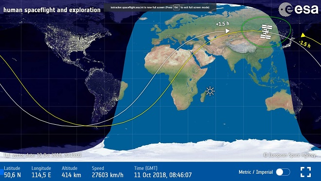
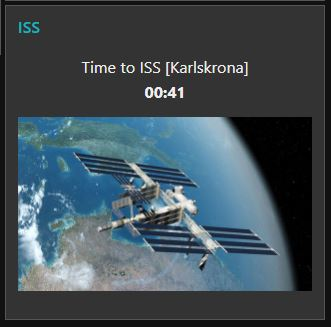
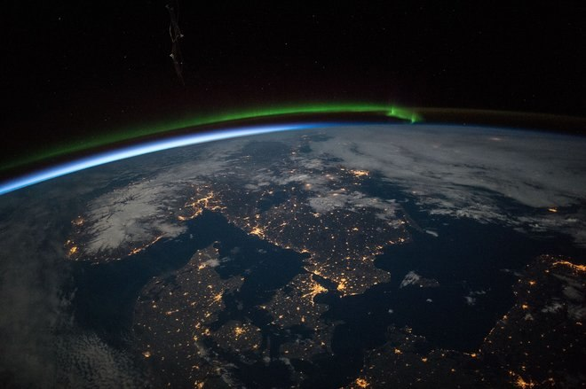

# Gallery

Our gallery shows various points of interest and various stages of our development of **arthur-remix**. Enjoy

Tracking the ISS via the [eesa site](https://spotthestation.nasa.gov/tracking_map.cfm)

Our ISS dashboard on Node RED (using the [IoT Raspberry Pi Device](https://raspberry-valley.azurewebsites.net/IoT-Raspberry-Pi-Device/))

Countdown in prototype (phat stack and Raspberry Pi Zero)

TODO: link video

[first test on zero and phat stack](img/issv01.gif)

We look at the ISS, ISS looks at us. Below is an amazing snapshot of Scandinavia from the international space station ( [source](https://www.pocket-lint.com/cameras/news/144794-amazing-images-from-the-international-space-station))

> "*Astronauts aboard the International Space Station took this image of southern Scandinavia just before midnight under a full moon. Prominent features include a green aurora to the north (upper middle of the image), the blackness of the Baltic Sea (lower right), clouds (top right) and snow in Norway illuminated under a full moon.*

> *City lights clearly show the recognizable coastline of the Skagerrak and Kattegat seaway leading into the Baltic Sea that separates Denmark from its neighbours to the north.*

> *The largest light clusters on the seaway are the capital cities of Oslo and Copenhagen. Cities facing the Baltic are the Polish port of Gdansk and the Swedish capital, Stockholm. Smaller cities in northern Germany reveal the Baltic coastline (lower right).*"
