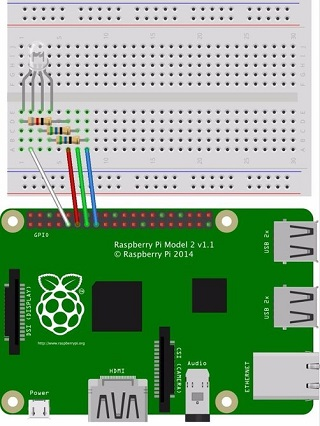

# Usage Scenarios

TODO

The section below describes different usage scenarios for usage.

## Stand-Alone Scenario - RGB Led (Raspberry Pi)

TODO

Go ahead and hide your Pi, or Pi Zero, into the 3D paper model of Arthur, and connect it to an RGB Led. A typical layout would be something similar to this, of course you can you basically any pin, depending on what other devices you need to use in parallel.

Connecting the RGB Led (Fritzing)



Whatever pin you choose, you can configure it in **config.py**, in GPIO Board mode (i.e. we provide the sequence # of the pin). For example, this is one of our configuration sections in the configuration file:

```python
# Configure pins for RGB LED. These are pin numbers (board mode). Used only by RGB Led modules

rgbled_red   = 16
rgbled_green = 18
rgbled_blue  = 22
```

Once you have connected the pins, you can run our script **iss-rgb.py** to blink the light. It will be blinking in 4 modes (far away, coming soon, nearly here, overhead). See the statuses section for details.

```bash
python iss-rgb.py
```

Once you have confirmed the script runs, you can use our recipe to [Autorun a Python Script](https://raspberry-valley.azurewebsites.net/Autorun-Python-Script/).

> Note: if you use Blinkt!, make sure the chosen pins do not conflict with the device. We have had some issues running an RGB Led and Blinkt! in parallel and had to tweak the settings a bit.

## Subscriber Scenario - Led Array (Raspberry Pi)

This configuration assumes you have MQTT setup and you have a publisher running. We have provided an example subscriber, which uses an array of leds and is provided by [Pimoroni](https://shop.pimoroni.com/products/blinkt). You might want to also check our [Blinkt](https://raspberry-valley.azurewebsites.net/Blinkt/) section for other usage ideas.

The file provided in this repo is a simple subscriber called **sub-iss-blinkt.py**. This code is a modified example from the official library (pulse.py), which is wired up as an MQTT listener to ISS events. Get a 'Knight Rider' experience with ISS. David won't mind :)

For your convenience, we have provided a simple way to run all scripts you need from one script: locate **launcher.py** and edit it to your liking. Add / remove scripts you need to use for your configuration. Check the overview section above for more details.

## Subscriber Scenario - RGB Led on IoT Device

This configuration assumes you have MQTT setup and you have a publisher running.

TODO

## Arduino circuit

TODO

---

Please note: while we do have Arduino code available, this is in development mode and awaits features and cleanup before it can be used in any scenario. The code is a stub at this point in time

---
